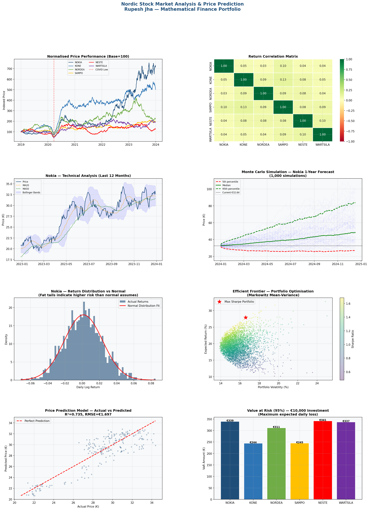

[nordic_stock_README.md](https://github.com/user-attachments/files/26127034/nordic_stock_README.md)
# Nordic Stock Market Analysis & Price Prediction

**Mathematical modelling of Nordic blue-chip stocks — statistical analysis, Monte Carlo simulation and portfolio optimisation**



---

## Overview

A comprehensive mathematical analysis of six major Nordic stocks listed on the Helsinki Stock Exchange (NASDAQ Helsinki). This project applies quantitative finance techniques rooted in mathematical statistics to analyse historical performance, model risk, simulate future price paths and optimise portfolio allocation.

**Stocks analysed:** Nokia, KONE, Nordea, Sampo, Neste, Wärtsilä

---

## Mathematical Techniques Applied

| Technique | Application |
|---|---|
| Geometric Brownian Motion | Price path simulation |
| Log-normal return analysis | Statistical return modelling |
| Jarque-Bera normality test | Return distribution testing |
| Bollinger Bands | Volatility-based technical analysis |
| Relative Strength Index (RSI) | Momentum indicator |
| Value at Risk (VaR) | Downside risk quantification |
| Monte Carlo Simulation | Probabilistic price forecasting |
| Linear Regression | 5-day price prediction model |
| Markowitz Mean-Variance | Portfolio optimisation — Efficient Frontier |

---

## Key Findings

| Finding | Value |
|---|---|
| Best performing stock (Sharpe Ratio) | KONE (1.25) |
| Optimal portfolio expected return | 27.9% annually |
|  Optimal portfolio volatility | 16.6% |
| Nokia 1-year upside probability | 86.7% |
| Price prediction model R² | 0.735 |
| SAMPO returns distribution | Non-normal — fat tails detected |

---

## Dashboard Components

**1. Normalised Price Performance**
All six stocks indexed to 100 at start — COVID-19 crash March 2020 clearly visible and annotated.

**2. Correlation Matrix**
Heatmap showing pairwise return correlations — KONE/SAMPO highest (0.133), Nokia/Nordea lowest (0.035). Low correlations confirm diversification benefits.

**3. Technical Analysis — Nokia**
12-month price chart with MA20, MA50 and Bollinger Bands overlay showing volatility compression and expansion cycles.

**4. Monte Carlo Simulation**
1,000 simulated price paths for Nokia over 12 months. 5th/50th/95th percentile paths shown — bear case €26.84, bull case €83.99.

**5. Return Distribution vs Normal**
Histogram of daily log returns with normal distribution overlay — demonstrates fat-tail risk where standard models underestimate extreme events.

**6. Efficient Frontier**
5,000 random portfolios plotted in risk-return space. Maximum Sharpe Ratio portfolio identified — optimal allocation heavily weights KONE (45.2%) and Nokia (26.6%).

**7. Prediction Model — Actual vs Predicted**
Scatter plot of actual vs predicted 5-day forward prices. R²=0.735 indicates strong predictive power of technical indicators.

**8. Value at Risk Comparison**
95% VaR for €10,000 investment across all six stocks — KONE lowest risk (€244/day), Neste highest (€341/day).

---

## Mathematical Background

### Geometric Brownian Motion
Price modelled as: **dS = μS dt + σS dW**
Where μ = drift, σ = volatility, dW = Wiener process increment

### Log Returns
**r_t = ln(S_t / S_{t-1})**
Preferred over simple returns — additive, approximately normally distributed, mathematically tractable

### Value at Risk
**VaR_α = -σ · Φ⁻¹(1-α) · √t · V**
Where Φ⁻¹ is inverse normal CDF, α = confidence level, V = portfolio value

### Sharpe Ratio
**S = (R_p - R_f) / σ_p**
Risk-adjusted return measure — higher is better

---

## Technical Stack

| Tool | Purpose |
|---|---|
| Python 3 | Core language |
| NumPy | Mathematical computations |
| SciPy | Statistical tests and distributions |
| Pandas | Time series data manipulation |
| Scikit-learn | Machine learning prediction model |
| Matplotlib / Seaborn | Visualisation |

---

## How to Run

```bash
pip install pandas numpy matplotlib seaborn scikit-learn scipy
python nordic_stock_analysis.py
```

**To use real market data**, replace the simulation section with:
```python
import yfinance as yf
tickers = ['NOKIA.HE', 'KONE.HE', 'NORDEA.HE', 'SAMPO.HE', 'NESTE.HE', 'WRT1V.HE']
prices_df = yf.download(tickers, start='2019-01-01', end='2023-12-31')['Adj Close']
```

---

## About

**Rupesh Jha** — Data Scientist | MSc Mathematics | MBA (International Business)

Mathematical foundations from MSc Mathematics applied to quantitative finance. Demonstrating how core statistical concepts — probability distributions, regression, simulation — translate directly to real-world financial analysis.

**GitHub:** github.com/rupesh-jha-data
## Academic References

### Project methodology informed by:
**Portfolio Optimisation & Monte Carlo:**
- Shaw, W.T. (2010). Monte Carlo Portfolio Optimization for General 
  Investor Risk-Return Objectives. arXiv:1008.3718
- Geometric Brownian Motion price simulation methodology per 
  IEEE Monte Carlo Simulation Prediction of Stock Prices (2022)

